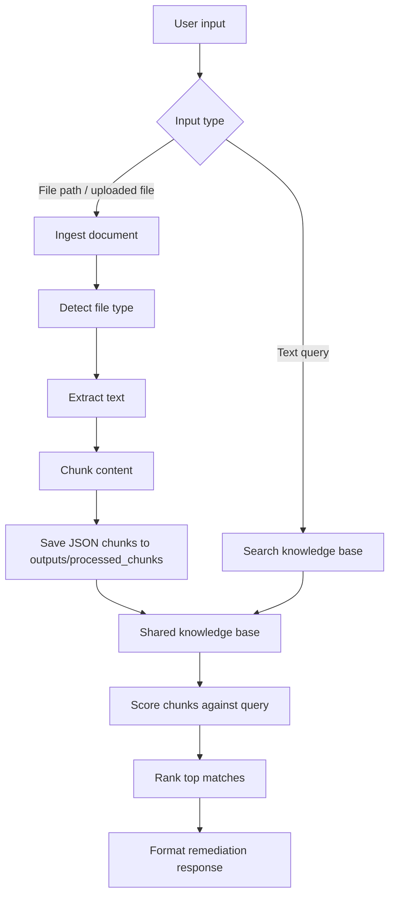

# Project Scope and Flow

This project is a lightweight remediation search engine for operational runbooks, troubleshooting guides, and incident notes. Its purpose is to turn unstructured documents into a reusable knowledge base and then retrieve the most relevant remediation steps when a user provides an alert name, symptom, or root-cause description.

## What The Project Covers

- Ingesting support documents from the local file system or through the API.
- Converting those documents into reusable JSON chunks.
- Storing processed chunks in a shared output directory.
- Searching the stored knowledge base for the best remediation matches.
- Formatting the final result for CLI, API, or UI consumption.

## What The Project Does Not Cover

- It does not replace an incident management platform.
- It does not automatically remediate systems or execute fixes.
- It does not train a large model; it relies on chunking, indexing, and scoring the existing knowledge base.
- It does not expose raw chunk management to end users; searches are handled through the CLI or API.

## End-To-End Flow

## Stage 1: Input Routing And Interface Management

This stage is the entry gate for the application. It decides whether the user is trying to build the knowledge base or search it.

- **1.1 Entry point execution:** The project can start from the CLI entry point or from the API server.
- **1.2 Input classification:** The system determines whether the input is a document path or a text query.
- **1.3 Logic routing:** File inputs are sent to ingestion, while text inputs are sent to remediation search.
- **1.4 Interface support:** The same core logic is exposed through CLI, REST API, and direct module imports for testing or integration.

## Stage 2: Document Ingestion And Knowledge Base Creation

This stage converts operational content into a structured knowledge base that can be searched repeatedly.

- **2.1 File type detection:** The project identifies supported formats such as PDF, DOCX, TXT, MD, CSV, JSON, PY, HTML, and XML.
- **2.2 Content extraction:** The raw text is read from the source document.
- **2.3 Data chunking:** The content is broken into smaller chunks so searches can match specific symptoms or steps more accurately.
- **2.4 Persistence:** Each processed chunk is saved as JSON in `outputs/processed_chunks/`.
- **2.5 Knowledge base compilation:** The saved chunks become the reusable source of truth for future remediation lookups.

## Stage 3: Remediation Search And Scoring

This stage is the core intelligence layer. It compares a user query against the stored knowledge base and identifies the most relevant remediation content.

- **3.1 Knowledge base loading:** The system reads the previously processed chunk files from `outputs/processed_chunks/`.
- **3.2 Query comparison:** The incident description or root-cause text is compared against every available chunk.
- **3.3 Relevance scoring:** A scoring strategy measures how closely each chunk matches the query.
- **3.4 Result ranking:** The highest-confidence matches are sorted to surface the best guidance first.

## Stage 4: Response Formatting And Delivery

This stage turns the search result into something the end user can immediately act on.

- **4.1 Response synthesis:** The most relevant remediation content is selected from the top-ranked chunks.
- **4.2 Formatting:** The response is structured into a readable format by `response_formatter.py`.
- **4.3 Final delivery:** The guidance is returned through the requested channel, such as CLI output or an API response.

## Interfaces And Ownership

| Module | Responsibility |
|---|---|
| `remediation_search/__main__.py` | CLI entry point and input routing |
| `remediation_search/document_processor.py` | Document loading, extraction, and chunking |
| `remediation_search/remediation_finder.py` | Knowledge base loading and match discovery |
| `remediation_search/response_formatter.py` | Final output formatting |
| `remediation_search/api/app.py` | API endpoints for UI and service integration |

## Shared Data Store

`outputs/processed_chunks/` is the bridge between ingestion and search.

- Ingestion writes chunk JSON files to this directory.
- Search reads the same files when handling a remediation request.
- This design keeps the system simple, reusable, and easy to operate without a separate database.

## Business Value

The project reduces the time needed to locate known fixes by turning scattered troubleshooting material into a searchable remediation layer. For a manager, the main value is faster incident triage, more consistent guidance, and a reusable workflow that can be exposed through CLI tools, APIs, or future UI integrations.

## Summary

The project flow is: input comes in, the system routes it to ingestion or search, the knowledge base is updated or queried, and the response is formatted into actionable remediation guidance.
