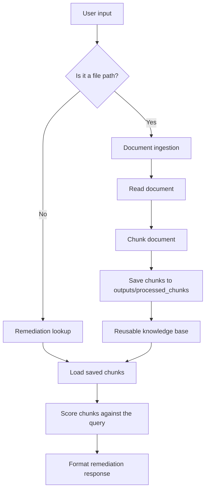

# Project Flow

This document describes how the project moves from input to output without changing or executing the application code.

## High-Level Flow

## Input Routes

The project starts by accepting a single input and routing it into one of two paths:

1. A supported document path such as `.pdf`, `.docx`, `.txt`, `.md`, `.csv`, `.json`, `.py`, `.html`, or `.xml`.
2. A plain text root-cause query such as an alert name or incident description.

## API Ingestion Route

The backend API exposes a dedicated upload path for adding knowledge files without using the CLI.

1. `POST /api/ingest`
2. Accepts `multipart/form-data`
3. Requires:
    - `file`: uploaded document
    - `api_key`: token value
4. Saves processed chunks into `outputs/processed_chunks/`

This route updates the same shared knowledge base used by the remediation search endpoints.

## Document Ingestion Flow

When the input is a file path, the project:

1. Detects the file type.
2. Loads the document content.
3. Splits the document into smaller chunks.
4. Stores each chunk as JSON in `outputs/processed_chunks/`.

This path prepares the knowledge base that later remediation searches use.

## Remediation Lookup Flow

When the input is plain text, the project:

1. Loads the saved chunk files from `outputs/processed_chunks/`.
2. Compares the query against each chunk.
3. Ranks the best matches.
4. Formats the top matches into a remediation response.

This path is what turns an alert or problem description into suggested remediation steps.

## Main Modules Involved

| Module | Responsibility |
|---|---|
| `remediation_search/__main__.py` | Routes input to ingestion or lookup |
| `remediation_search/document_processor.py` | Reads and chunks documents |
| `remediation_search/remediation_finder.py` | Loads chunks and finds relevant matches |
| `remediation_search/response_formatter.py` | Formats the final output |
| `remediation_search/api/app.py` | Exposes the API for UI integration |

## Shared Data Store

`outputs/processed_chunks/` is the shared bridge between ingestion and lookup:

- Ingestion writes chunk JSON files there.
- Lookup reads those same files when answering a query.

## External Interfaces

The project can be used through:

1. The CLI entry point.
2. The API server for UI-driven workflows.
3. Direct module imports for testing or integration.

## Result

The overall project flow is:

input -> route -> process or search -> format output -> return remediation guidance